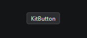
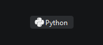

# `KitButton`

Кнопка с текстом и/или иконкой

Наследует `QPushButton`

```python
from PyQtUIkit.widgets import KitButton

button = KitButton("KitButton")
```


```python
from PyQtUIkit.widgets import KitButton

button = KitButton("Python", icon='python')
button.border = 0
```


### Параметры:

- `main_palette` (`KitPalette`, по умолчанию `'Main'`)
- `icon` (`str` (из встроенной коллекции иконок) или `KitIcon` (из файла))
- `border` (`int`, по умолчанию 1)
- `radius` (`int`, по умолчанию 4)

[◀ На главную страницу](..%2Freadme.md)
