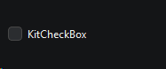
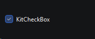

# `KitCheckBox`

Наследует `QWidget`

```python
from PyQtUIkit.widgets import KitCheckBox

checkbox = KitCheckBox("KitCheckBox")
```



### Параметры:

- `main_palette` (`KitPalette`, по умолчанию `'Main'`)

### Сигналы

- `stateChanged`

### Методы

- `state` Возвращает True, если элемент выбран, иначе False
- `setState` устанавливает значение

[◀ На главную страницу](..%2Freadme.md)
