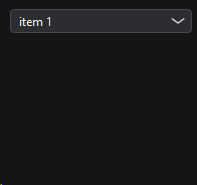
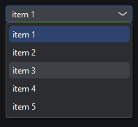
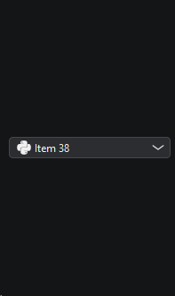
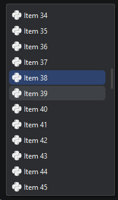

# `KitComboBox`

Виджет, позволяющий выбрать одно из предложенных значений

Наследует `QPushButton`

```python
from PyQtUIkit.widgets import KitComboBox

combo_box = KitComboBox('item 1', 'item 2', 'item 3', 'item 4', 'item 5')
```




```python
from PyQtUIkit.widgets import KitComboBox, KitComboBoxItem

combo_box = KitComboBox()
for i in range(100):
    combo_box.addItem(KitComboBoxItem(f"Item {i + 1}", i, icon='python'))
combo_box.type = 2
```



### Параметры:

- `main_palette` (`KitPalette`, по умолчанию `'Transparent'`)
- `border` (`int`, по умолчанию 0)
- `radius` (`int`, по умолчанию 4)
- `type` (1 или 2)

[◀ На главную страницу](..%2Freadme.md)
