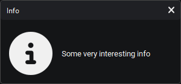
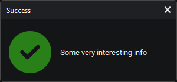
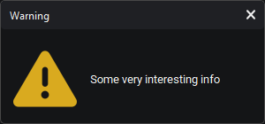
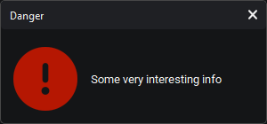
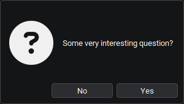

# `KitDialog`

Виджет для отображения текста

Наследует `QDialog`

### Message Box

```python
from PyQt6.QtWidgets import QApplication
from PyQtUIkit.widgets import KitMainWindow, KitButton, KitDialog, KitHBoxLayout

class MainWindow(KitMainWindow):
    def __init__(self):
        super().__init__()
        main_layout = KitHBoxLayout()
        self.setCentralWidget(main_layout)
        button = KitButton("Press me!")
        main_layout.addWidget(button)
        button.clicked.connect(self.open_dialog)

    def open_dialog(self):
        KitDialog.info(self, "Info", "Some very interesting info")
        
app = QApplication([])
window = MainWindow()
window.show()
app.exec()
```


### Success

```python
KitDialog.success(self, "Success", "Some very interesting info")
```


### Warning

```python
KitDialog.warning(self, "Warning", "Some very interesting info")
```


### Danger

```python
KitDialog.danger(self, "Danger", "Some very interesting info")
```


### Question

```python
answer = KitDialog.question(self, "Some very interesting question?")
print(answer)
```


### Параметры:

- `main_palette` (`KitPalette`, по умолчанию `'Transparent'`)
- `button_close` (`bool`, по умолчанию True)
- `name` (`str`, по умолчанию "")

[◀ На главную страницу](..%2Freadme.md)
