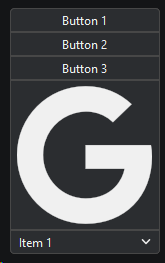

# `KitHGroup`, `KitVGroup`

Наследует `KitHBoxLayout` (`KitVBoxLayout`)

Позволяет группировать следующие виджеты:
- `KitButton`
- `KitIconButton`
- `KitLineEdit`
- `KitComboBox`
- `KitSpinBox`

```python
from PyQtUIkit.widgets import KitHGroup, KitButton, KitIconButton, KitComboBox

group = KitHGroup()
group.addItem(KitButton("Button 1"))
group.addItem(KitButton("Button 2"))
group.addItem(KitButton("Button 3"))
group.addItem(KitIconButton('brands-google'))
combo = KitComboBox()
for i in range(30):
    combo.addItem(f"Item {i + 1}")
group.addItem(combo)
```


```python
from PyQtUIkit.widgets import KitVGroup, KitButton, KitIconButton, KitComboBox

group = KitVGroup()
group.addItem(KitButton("Button 1"))
group.addItem(KitButton("Button 2"))
group.addItem(KitButton("Button 3"))
group.addItem(KitIconButton('brands-google'))
combo = KitComboBox()
for i in range(30):
    combo.addItem(f"Item {i + 1}")
group.addItem(combo)
```


### Параметры:

- `main_palette` (`KitPalette`, по умолчанию `'Transparent'`)
- `border` (`int`, по умолчанию 0)
- `radius` (`int`, по умолчанию 4)
- `height` / `width`

### Методы

- `addItem`
- `insertItem`
- `clear`

[◀ На главную страницу](..%2Freadme.md)
