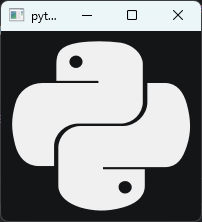

# `KitIconWidget`

Виджет для отображения изображений

Наследует `QWidget`

```python
from PyQtUIkit.widgets import KitIconWidget

icon_widget = KitIconWidget('python')
```


### Параметры:

- `main_palette` (`KitPalette`, по умолчанию `'Transparent'`)
- `icon` (`str` (из встроенной коллекции иконок) или `KitIcon` (из файла))
- `border` (`int`, по умолчанию 0)
- `radius` (`int`, по умолчанию 4)

[◀ На главную страницу](..%2Freadme.md)
