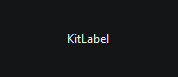
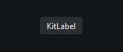

# `KitLabel`

Виджет для отображения текста

Наследует `QLabel`

```python
from PyQtUIkit.widgets import KitLabel

label = KitLabel("KitLabel")
```
 


```python
from PyQtUIkit.widgets import KitLabel

label = KitLabel("KitLabel")
label.main_palette = 'Main'
label.setContentsMargins(10, 5, 10, 5)
```
 

### Параметры:

- `main_palette` (`KitPalette`, по умолчанию `'Transparent'`)
- `border` (`int`, по умолчанию 0)
- `radius` (`int`, по умолчанию 4)

[◀ На главную страницу](..%2Freadme.md)
