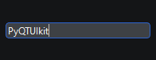

# `KitLineEdit`

Виджет для ввода текста

Наследует `QLineEdit`

```python
from PyQtUIkit.widgets import KitLineEdit

Line_edit = KitLineEdit()
```


### Параметры:

- `main_palette` (`KitPalette`, по умолчанию `'Main'`)
- `border` (`int`, по умолчанию 0)
- `radius` (`int`, по умолчанию 4)

[◀ На главную страницу](..%2Freadme.md)
