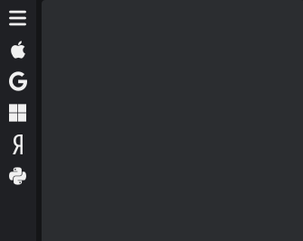
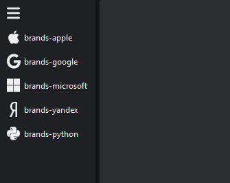

# `KitNavigation`

Наследует `KitVBoxLayout`

```python
from PyQtUIkit.widgets import *

nav = KitNavigation()
nav.button_size = 30
nav.button_radius = 6

for el in ['brands-apple', 'brands-google', 'brands-microsoft', 'brands-yandex', 'brands-python']:
    nav.addTab(el, el)
```



### Параметры:

- `main_palette` (`KitPalette`, по умолчанию `'Transparent'`)
- `border` (`int`, по умолчанию 0)
- `radius` (`int`, по умолчанию 0)
- `button_size` (`int`, по умолчанию 30)
- `button_radius` (`int`, по умолчанию 4)

### Сигналы:

- `currentChanged`

### Методы

- `expand`
- `collapse`
- `addTab`
- `insertTab`
- `setCurrentTab`
- `clear`
- `currentIndex`

[◀ На главную страницу](..%2Freadme.md)
