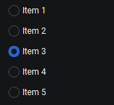
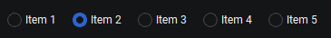

# `KitVRadio`, `KitHRadio`

Наследует `KitVBoxLayout` (`KitHBoxLayout`)

```python
from PyQtUIkit.widgets import *

radio = KitVRadio()
radio.addItem("Item 1")
radio.addItem("Item 2")
radio.addItem("Item 3")
radio.addItem("Item 4")
radio.addItem("Item 5")
```


```python
from PyQtUIkit.widgets import *

radio = KitHRadio()
radio.addItem("Item 1")
radio.addItem("Item 2")
radio.addItem("Item 3")
radio.addItem("Item 4")
radio.addItem("Item 5")
```


### Параметры:

- `main_palette` (`KitPalette`, по умолчанию `'Transparent'`)
- `border` (`int`, по умолчанию 0)
- `radius` (`int`, по умолчанию 0)
- `button_height` (`int`, по умолчанию 24)

### Сигналы:

- `currentChanged`

### Методы

- `addTab`
- `insertTab`
- `setCurrentTab`
- `clear`
- `currentIndex`

[◀ На главную страницу](..%2Freadme.md)
