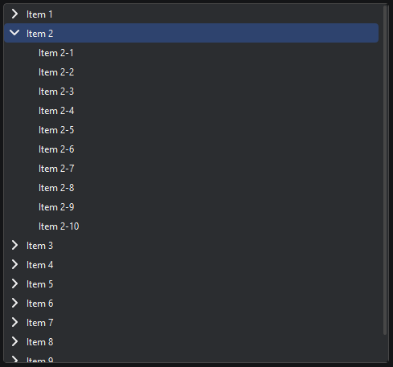

# `KitTreeWidget`

Виджет для отображения текста

Наследует `KitScrollArea`

```python
from PyQtUIkit.widgets import KitTreeWidget, KitTreeWidgetItem

tree = KitTreeWidget()
for i in range(10):
    item = KitTreeWidgetItem(f'Item {i + 1}')
    tree.addItem(item)
    for j in range(10):
        item.addItem(KitTreeWidgetItem(f"Item {i + 1}-{j + 1}"))
```


### Параметры:

- `main_palette` (`KitPalette`, по умолчанию `'Main'`)
- `border` (`int`, по умолчанию 1)
- `radius` (`int`, по умолчанию 4)

### Сигналы:

- `currentItemChanged`

### Методы:

- `addItem`
- `currentItem`

[◀ На главную страницу](..%2Freadme.md)
